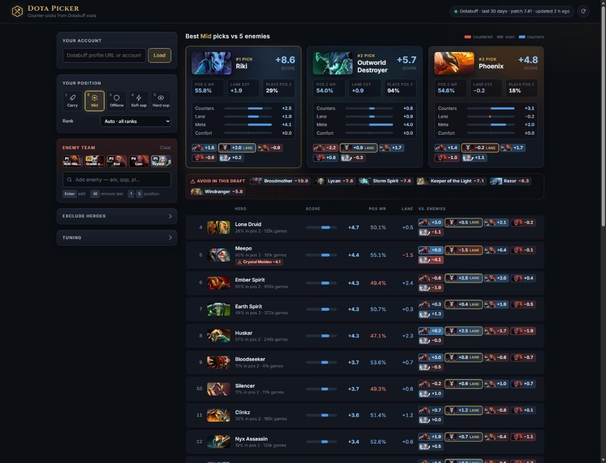
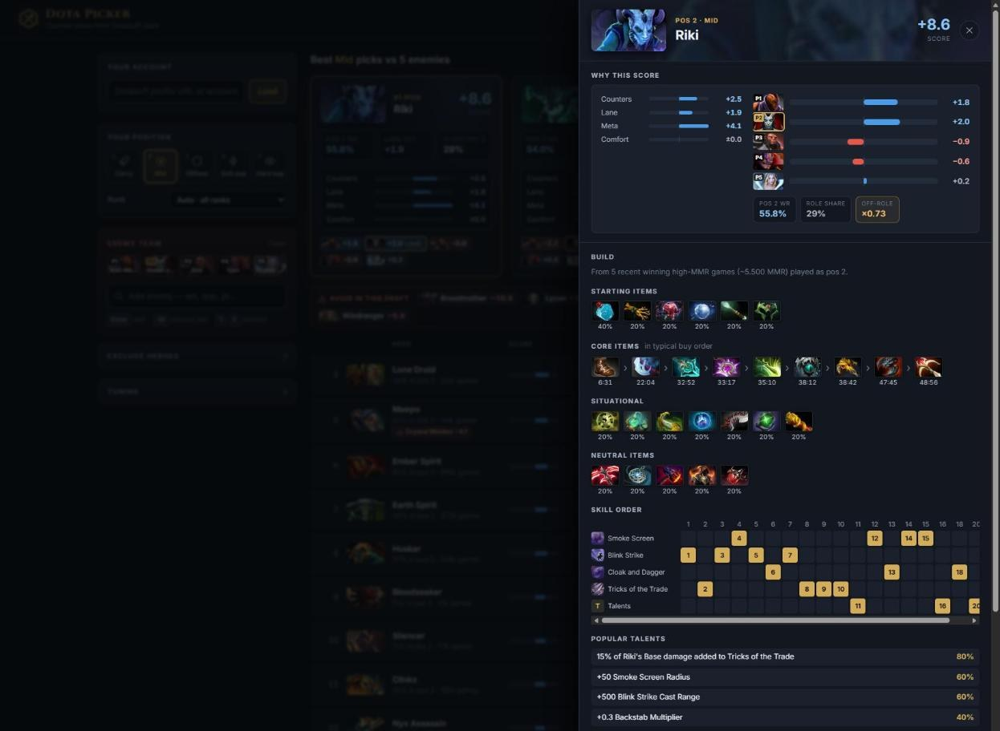
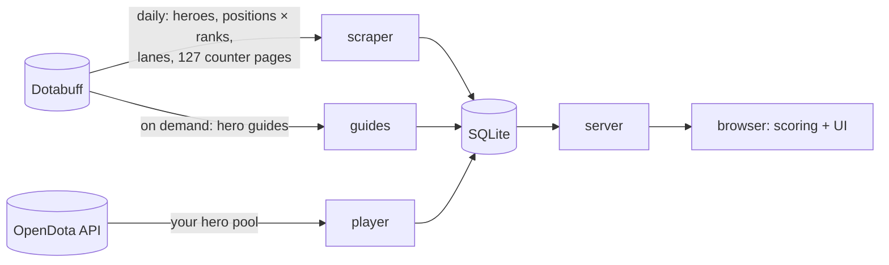

<div align="center">


# Dota Picker

**Counter-pick suggestions for your Dota 2 drafts, built on Dotabuff stats.**

Type the enemy heroes, choose your position, and get ranked picks with matchups, lane estimates,
your own hero pool and the item and skill builds high-MMR players use.

[](https://github.com/n-gao/dota-picker/actions/workflows/ci.yml)
[](https://github.com/n-gao/dota-picker/pkgs/container/dota-picker)

[](LICENSE)



</div>

## Features

- **Fast draft entry.** Type `am`, `qop`, `pl` or any part of a name and press <kbd>Enter</kbd>.
  <kbd>Backspace</kbd> removes the last hero and <kbd>1</kbd>–<kbd>5</kbd> switches your position.
- **Counter scores.** Every hero's matchup against each enemy, adjusted for sample size, plus how
  well it does in your position and rank bracket.
- **Lane estimates.** Works out which enemy plays which role from the whole draft, then weighs
  the matchups against the heroes most likely in your lane.
- **Your hero pool.** Paste your Dotabuff profile to favour heroes you play, or show only those.
  Your rank is detected automatically.
- **Builds.** Click a hero for starting and core items with timings, situational and neutral
  items, a skill-order grid and popular talents, taken from recent high-MMR games in your position.
- **Explainable.** Each score is split into counters, lane, meta and comfort, with a bar for every
  enemy matchup. ⚠ badges and an "avoid" list warn you about hard counters.
- **Self-contained.** One Python process and one SQLite file. Data refreshes daily, snapshots are
  kept for trends, and broken scrapes are rejected.

<p align="center">
  
</p>

## Quick start

### Docker

```sh
docker run -d --name dota-picker -p 8000:8000 -v dota-picker-data:/data \
  ghcr.io/n-gao/dota-picker:latest
```

Open <http://localhost:8000>. The first start scrapes Dotabuff, which takes about 15 seconds.

### From source

Requires [uv](https://docs.astral.sh/uv/) (or Python 3.11+ and pip).

```sh
git clone https://github.com/n-gao/dota-picker.git
cd dota-picker
uv run dota-picker serve
```

## Usage

```text
dota-picker serve  [--host 127.0.0.1] [--port 8000] [--no-refresh]   # run the web app (default)
dota-picker scrape [--force]                                         # refresh the cache once and exit
```

| Environment variable       | Default            | Purpose                                   |
|----------------------------|--------------------|-------------------------------------------|
| `DOTA_PICKER_DB`           | `data/dota.sqlite` | SQLite database path                      |
| `HOST` / `PORT`            | `127.0.0.1` / `8000` | Bind address (the image uses `0.0.0.0`) |
| `DOTA_PICKER_AUTO_REFRESH` | `1`                | Set to `0` to turn off the daily refresh  |

## How it works



Each candidate hero that plays your position gets a score:

```text
score = Σ matchup advantage vs. each enemy
      + lane weight    × Σ P(enemy in your lane) × advantage
      + meta weight    × role confidence × (position win rate − 50)
      + comfort weight × your experience on the hero
```

- **Sample size.** A stat based on *n* games counts *n / (n + 3000)*. Small matchups shrink towards 0.
  Rank-specific win rates shrink towards the all-ranks rate.
- **Off-role picks.** A hero rarely played in your position (for example carry Leshrac) gets a
  smaller meta term. Only specialists play these, so their win rates look better than they are.
- **Role inference.** Every way of assigning the enemies to positions is weighted by how often
  each hero plays each role. Your lane opponents are enemy pos 3/4 if you're pos 1/5, mid if
  you're mid, and pos 1/5 if you're pos 3/4.
- **Patch handling.** Stats cover the last 30 days. During the first 30 days of a new patch they
  switch to that patch only.
- **Builds.** 20 recent guide games per hero, filtered to your position, aggregated into item
  shares, median timings and the most common skill at each level.

All weights can be changed under **Tuning** in the app.

## Data

Everything lives in one SQLite file. Each daily scrape is stored as a snapshot: the newest one is
served, older ones are kept daily for 30 days and then weekly. A new scrape is rejected if any
table shrinks by more than 10%, so a change to Dotabuff's site can't wipe your data.

A full refresh is about 180 page requests. Hero guides and icons are fetched only when you open a
hero, and are cached.

## Development

```sh
uv sync                                    # install with dev tools
uv run pre-commit install --install-hooks  # ruff, lockfile and hygiene checks on commit, tests on push
uv run pytest                              # tests
```

```text
dota_picker/
├── __main__.py   CLI (serve / scrape)
├── scraper.py    Dotabuff hero, position, lane and counter stats
├── guides.py     Dotabuff hero guides → item and skill builds
├── player.py     OpenDota player hero pools
├── db.py         SQLite schema, snapshots, export
├── server.py     HTTP server and background refresh
└── static/       the web app (vanilla HTML, CSS and JS, no build step)
```

CI runs the pre-commit hooks and tests on every push, smoke-tests the container, then publishes a multi-arch image
(amd64/arm64) to `ghcr.io`. The image is tagged with the commit SHA, the branch name, `latest`
on the default branch, and a version for `v*` git tags. See [CONTRIBUTING.md](CONTRIBUTING.md).

## Disclaimer

Dota Picker is **vibe coded**. It is also an unofficial fan project. It is not affiliated with or endorsed by Dotabuff,
OpenDota or Valve. Statistics come from [Dotabuff](https://www.dotabuff.com) and player hero
pools from the [OpenDota API](https://docs.opendota.com). Please keep the refresh rate modest
and respect their terms of use. Dota 2 is a registered trademark of Valve Corporation.

## License

[MIT](LICENSE)
